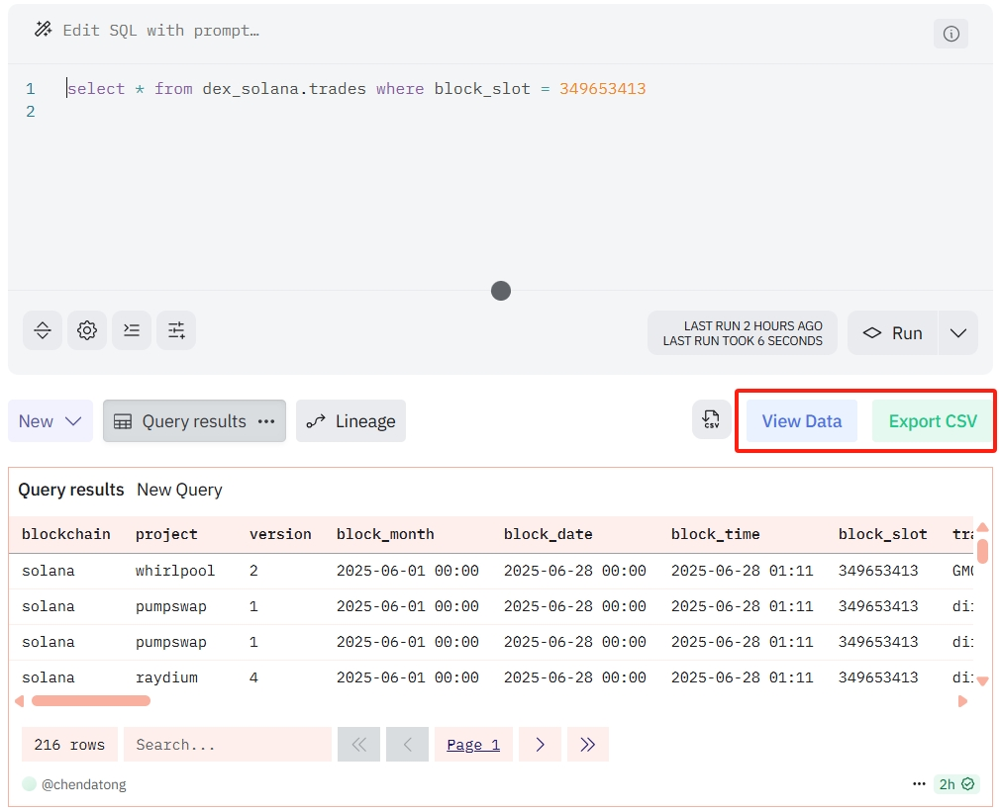
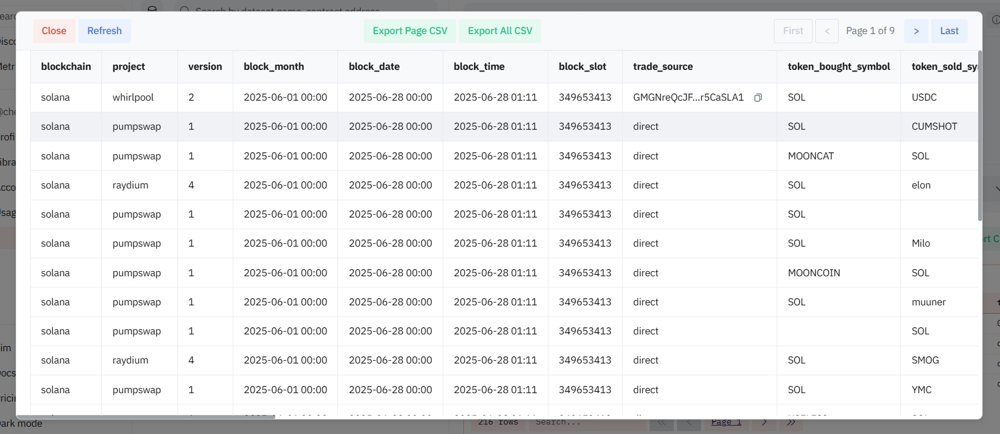
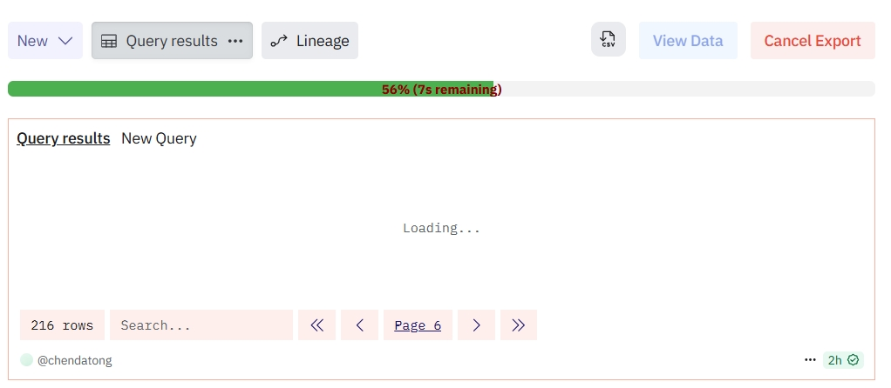

# Dune Assistant

[简体中文](README.zh-CN.md)

Dune Assistant is a Chrome extension designed to enhance your data interaction experience on the Dune Analytics platform. It allows you to view Dune query results more conveniently and supports exporting query results as CSV files.

## Features

*   **Data Overview**: Adds a "View Data" button to the Dune query page. Clicking it opens a modal displaying the current page's query results, with pagination.
*   **Single Page Export**: Provides an "Export Page CSV" button within the modal to export the currently displayed page's data.
*   **Full Export**: Offers an "Export CSV" button on both the Dune query page and within the modal (as "Export All CSV" in the modal) to automatically iterate through all pages and export the complete query results to a CSV file.
*   **Progress Display**: Shows a progress bar and estimated completion time during full data export.
*   **Data Copy**: Within the modal, supports copying the full content of a cell, even if the content is truncated.

## Screenshots

### View Data and Export CSV Buttons

### View Data Modal

### Export Progress

## Installation Steps

1.  **Download the Extension**:
    *   Visit the project's GitHub repository: `https://github.com/cdt2019/dune-assistant`
    *   Click the `Code` button and select `Download ZIP` to download the project archive.
    *   Unzip the downloaded `dune-assistant-main.zip` file to a folder on your computer (e.g., `D:\VisulSpace\dune-assistant`).

2.  **Load the Extension in Chrome**:
    *   Open the Chrome browser.
    *   Type `chrome://extensions/` in the address bar and press Enter to go to the extensions management page.
    *   In the top right corner of the page, turn on **"Developer mode"**.
    *   Click the **"Load unpacked"** button in the top left.
    *   In the file selection dialog that appears, select the `dune-assistant` folder you unzipped earlier, then click "Select Folder".

3.  **Complete Installation**:
    *   The extension should now be successfully loaded and displayed in your Chrome extensions list.
    *   You can see the Dune Assistant icon on your Chrome browser's toolbar.

## Usage

1.  **Access Dune Query Page**:
    *   In your Chrome browser, navigate to any Dune Analytics query results page (e.g., `https://dune.com/queries/...`).

2.  **View Buttons**:
    *   After the page loads, you will see two new buttons near the query results table:
        *   **View Data**: Clicking this button will pop up a modal displaying the current page's data.
        *   **Export CSV**: Clicking this button will directly start exporting all pages' data to a CSV file.

3.  **Using the "View Data" Modal**:
    *   After clicking the **View Data** button, a modal containing the query results will appear.
    *   **Pagination**: At the bottom of the modal, there are pagination control buttons (First, <, >, Last). You can click them to browse data on different pages.
    *   **Refresh**: Clicking the "Refresh" button can refresh the data displayed in the modal, synchronizing it with the latest data on the Dune page.
    *   **Export Page CSV**: Clicking this button will export the data currently displayed in the modal.
    *   **Export All CSV**: Clicking this button will start exporting data from all pages.

4.  **Exporting CSV File**:
    *   Whether you click the **Export CSV** button on the main page or the **Export All CSV** button in the modal, the extension will automatically iterate through all pages and collect data.
    *   During the export process, you will see a progress bar showing the export progress and estimated remaining time.
    *   Once the export is complete, the CSV file will automatically download to your default download directory. The filename format will be `dune_export_[page_info]_[timestamp].csv`.

5.  **Cancel Export**:
    *   During the export process, the button next to the progress bar will change to "Cancel Export". Clicking this button can interrupt the export process at any time.
