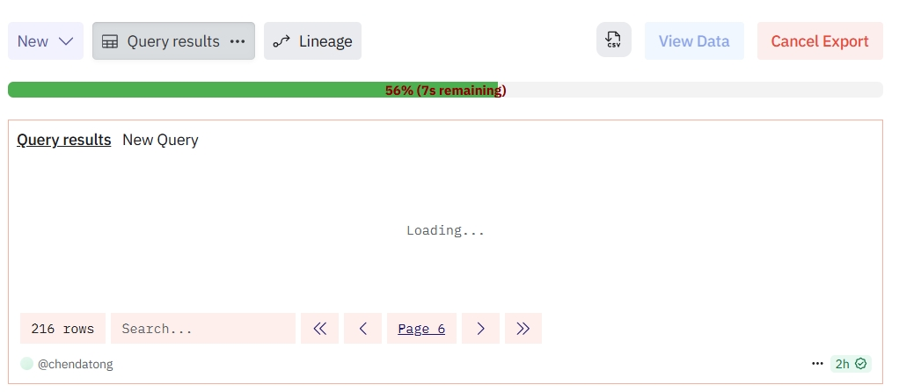

# Dune Assistant

Dune Assistant 是一款 Chrome 扩展程序，旨在增强您在 Dune Analytics 平台上的数据交互体验。它允许您更方便地查看 Dune 查询结果，并支持将查询结果导出为 CSV 文件。

## 功能特性

*   **数据概览**：在 Dune 查询页面上添加一个“View Data”按钮，点击后可在模态框中查看当前页面的查询结果，并提供分页浏览功能。
*   **单页导出**：在模态框中提供“Export Page CSV”按钮，用于导出当前显示页面的数据。
*   **全量导出**：在 Dune 查询页面和模态框中都提供“Export CSV”按钮（模态框中为“Export All CSV”），用于自动遍历所有分页并导出完整的查询结果到 CSV 文件。
*   **进度显示**：在导出全量数据时，显示进度条和预计完成时间。
*   **数据复制**：在模态框中，支持复制单元格的完整内容，即使内容被截断。

## 效果图

### 查看数据和导出 CSV 按钮

### 查看数据模态框

### 导出进度

## 安装步骤

1.  **下载扩展程序**：
    *   访问项目的 GitHub 仓库：`https://github.com/cdt2019/dune-assistant`
    *   点击 `Code` 按钮，选择 `Download ZIP` 下载项目压缩包。
    *   解压下载的 `dune-assistant-main.zip` 文件到您电脑上的一个文件夹中（例如：`D:\VisulSpace\dune-assistant`）。

2.  **在 Chrome 中加载扩展程序**：
    *   打开 Chrome 浏览器。
    *   在地址栏输入 `chrome://extensions/` 并按回车键，进入扩展程序管理页面。
    *   在页面右上角，打开 **“开发者模式”** 开关。
    *   点击左上角的 **“加载已解压的扩展程序”** 按钮。
    *   在弹出的文件选择框中，选择您之前解压的 `dune-assistant` 文件夹，然后点击“选择文件夹”。

3.  **完成安装**：
    *   扩展程序现在应该已经成功加载并显示在您的 Chrome 扩展程序列表中。
    *   您可以在 Chrome 浏览器的工具栏上看到 Dune Assistant 的图标。

## 使用方式

1.  **访问 Dune 查询页面**：
    *   在 Chrome 浏览器中，导航到任何一个 Dune Analytics 的查询结果页面（例如：`https://dune.com/queries/...`）。

2.  **查看按钮**：
    *   页面加载完成后，您会在查询结果表格附近看到两个新的按钮：
        *   **View Data**：点击此按钮将弹出一个模态框，显示当前页面的数据。
        *   **Export CSV**：点击此按钮将直接开始导出所有页面的数据到 CSV 文件。

3.  **使用“View Data”模态框**：
    *   点击 **View Data** 按钮后，会弹出一个包含查询结果的模态框。
    *   **分页浏览**：模态框底部有分页控制按钮（First, <, >, Last），您可以点击它们来浏览不同页的数据。
    *   **Refresh**：点击“Refresh”按钮可以刷新模态框中显示的数据，使其与 Dune 页面上的最新数据同步。
    *   **Export Page CSV**：点击此按钮将导出模态框中当前显示页面的数据。
    *   **Export All CSV**：点击此按钮将开始导出所有页面的数据。

4.  **导出 CSV 文件**：
    *   无论您点击主页面上的 **Export CSV** 按钮还是模态框中的 **Export All CSV** 按钮，扩展程序都会自动遍历所有分页并收集数据。
    *   导出过程中，您会看到一个进度条显示导出进度和预计剩余时间。
    *   导出完成后，CSV 文件将自动下载到您的默认下载目录。文件名格式为 `dune_export_[page_info]_[timestamp].csv`。

5.  **取消导出**：
    *   在导出过程中，进度条旁边的按钮会变为“Cancel Export”。点击此按钮可以随时中断导出过程。
